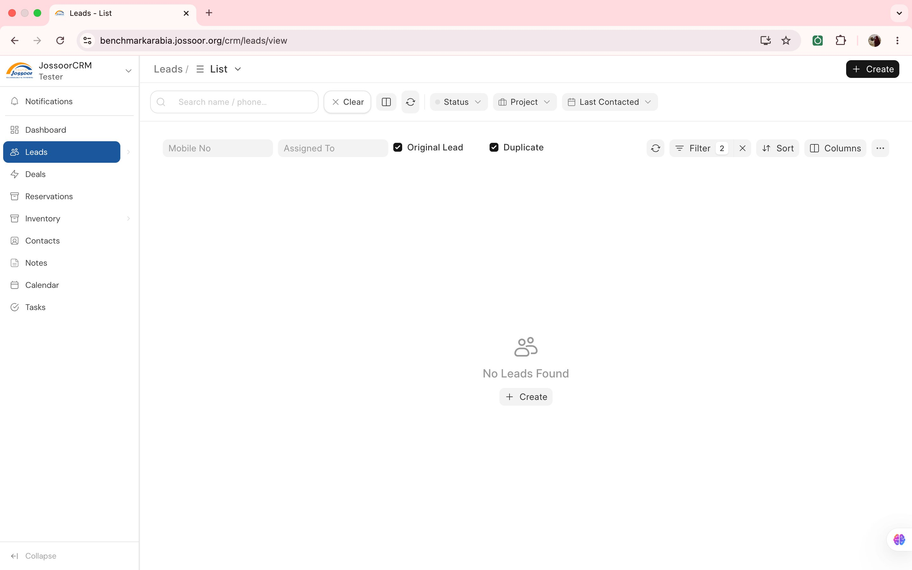
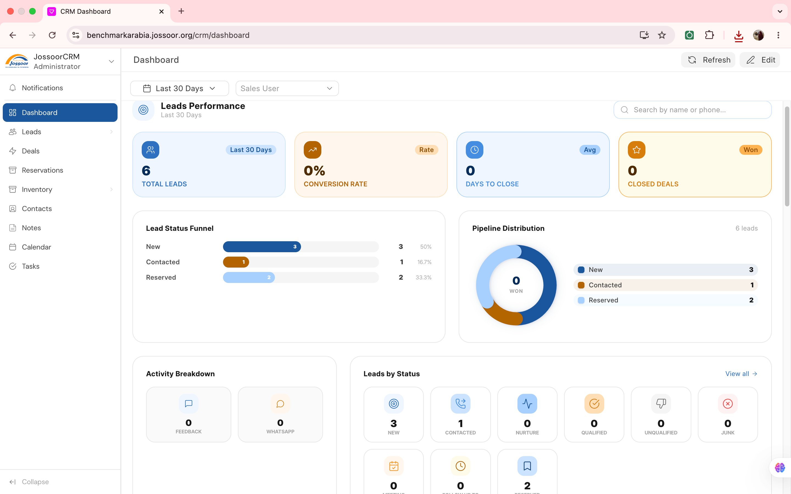
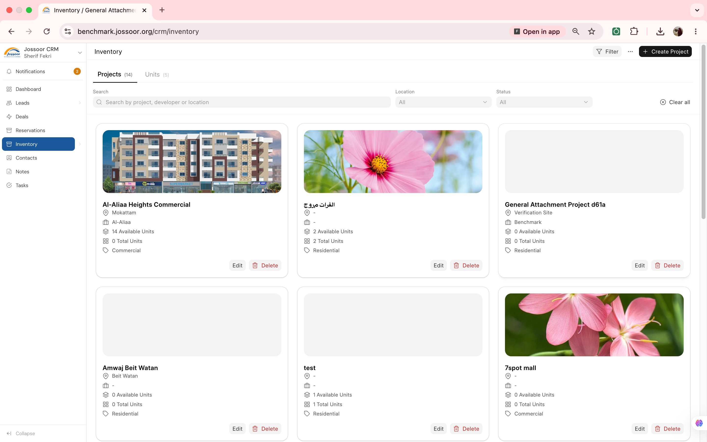
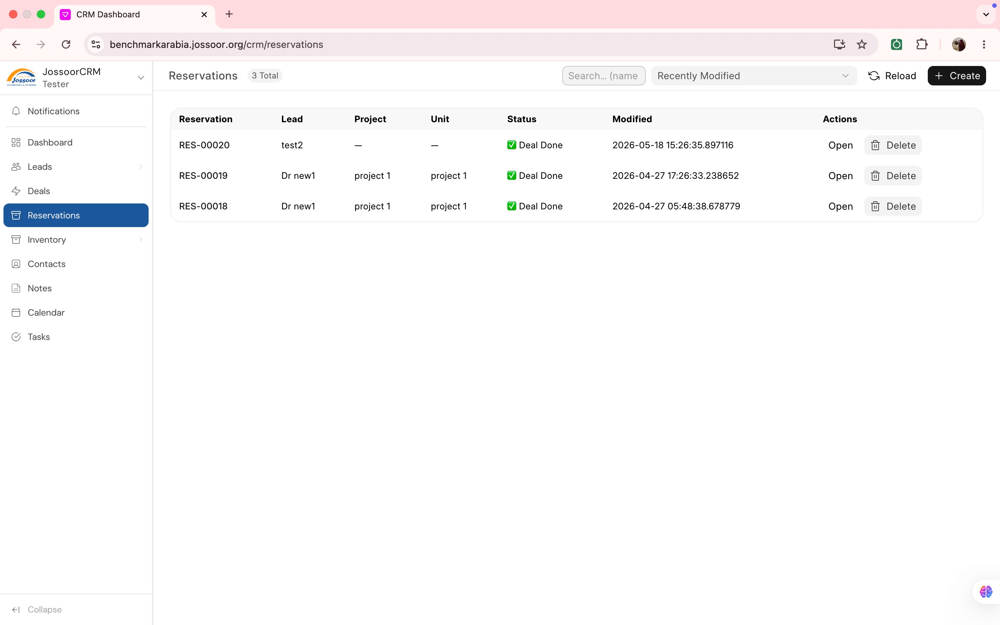

<div align="center">


# JossoorCRM

**Real Estate CRM Built for the Egyptian Market**

*A powerful, customized CRM tailored for real estate sales teams — built on Frappe CRM*

[](https://github.com/jossoor/JossoorCRM-Real-Estate.git)
[](https://frappe.io)
[](LICENSE)

</div>

---

## What is JossoorCRM?

JossoorCRM is a fully customized fork of [Frappe CRM](https://github.com/frappe/crm), purpose-built for Egyptian real estate companies. It extends the base CRM with a complete property inventory system, reservation pipeline, sales team management, and mobile push notifications — all designed around the workflows of real estate sales agents and managers.

---

## Screenshots

### Leads List
Smart lead management with duplicate detection, custom filters by project, status, and last contact date.



---

### Analytics Dashboard
Real-time performance dashboard with Leads Performance KPIs, Lead Status Funnel, Pipeline Distribution donut chart, Activity Breakdown, and Leads by Status — all filterable by date range and sales user.



---

### Inventory
Visual project cards showing cover image, location, developer, available units, total units, and category. Filter by location and status across 14+ real estate projects.



---

### Reservations
Full reservation pipeline tracking — from lead to unit reservation to deal closure, with automatic CRM Deal creation on status change.



---

## Key Features

### 🏢 Real Estate Inventory
- **Projects & Units** — manage real estate projects with phases, units, pricing, and availability
- **Phase-based visibility** — agents see only units from active phases; managers control which phases are open
- **Unit Pricing Validation** — backend guards against unrealistic area and price values

### 👥 Lead Management
- **Duplicate detection** — automatic Egyptian phone number normalization (+20, 0020, 01x) with deduplication on insert
- **Property preferences** — 20+ preference fields per lead (city, region, type, bedrooms, price range, payment method, etc.)
- **Activity log** — every field change auto-logged as a timeline activity

### 📋 Reservation Pipeline
- **Reservation → Deal flow** — when a reservation reaches "Deal Done", a CRM Deal is automatically created with all data copied over
- **Payment plans** — installment schedule management linked to reservations
- **Status tracking** — full audit trail from Reserved → Deal Done → Closed

### 📊 Analytics Dashboard
- **Leads performance** — new leads, conversion rates, sources
- **Inventory performance** — units available, reserved, sold per project
- **Tasks performance** — completion rates, overdue tasks, by type and priority
- **Role-based scoping** — sales agents see only their own data; team leaders see their team

### 🔔 Mobile Push Notifications
- **Firebase FCM** — push notifications to the JossoorCRM Flutter mobile app
- **Real-time bell** — in-app notification center for assignments, mentions, and alerts
- **Reminder system** — delayed follow-up detection with per-minute overdue flagging

### 👨‍💼 Sales Team Management
- **Teams & Members** — team leaders with member assignment
- **Permission isolation** — agents see only their leads; team leaders see their team's leads
- **Assignment tracking** — lead ownership with DocShare enforcement

### 📱 Mobile App Support
- **Flutter integration** — FCM token registration per device
- **One device = one user** — automatic token reassignment on login switch
- **Mobile OAuth** — dedicated mobile login settings

---

## Architecture

```
JossoorCRM
├── Real Estate Domain
│   ├── Real Estate Project    (master project record)
│   ├── Project Unit           (unit with phase + pricing)
│   ├── Reservation            (lead → unit → deal pipeline)
│   └── Payment Plan           (installment schedules)
│
├── CRM Extensions
│   ├── CRM Lead               (+ property preferences + duplicate detection)
│   ├── CRM Deal               (+ payment plan snapshot + reservation link)
│   └── CRM Task               (+ task types + multi-user assignment)
│
├── Team System
│   ├── Team                   (team leader + members)
│   └── Custom Permissions     (agent/leader/manager scoping)
│
└── Notifications
    ├── Firebase FCM            (mobile push)
    ├── CRM Notification        (in-app bell)
    └── Reminder Runner         (overdue follow-up detection)
```

---

## Tech Stack

| Layer | Technology |
|---|---|
| Backend | Python, Frappe Framework v15 |
| Frontend | Vue 3, Vite, Pinia, frappe-ui |
| Mobile | Flutter (FCM push notifications) |
| Database | MariaDB |
| Queue | Redis + RQ |
| Push | Firebase Cloud Messaging (FCM v1) |

---

## Getting Started

### Prerequisites
- Frappe Bench set up ([installation guide](https://docs.frappe.io/framework/user/en/installation))
- Python 3.10+
- Node.js 18+

### Installation

```bash
# Get the app
bench get-app https://github.com/hebashaaban23/JossoorCRM-Upgraded.git

# Install on your site
bench --site your-site.com install-app crm

# Build frontend
bench build --app crm

# Restart
bench restart
```

### Firebase Setup (for mobile push notifications)

1. Create a Firebase project at [console.firebase.google.com](https://console.firebase.google.com)
2. Generate a service account key: Project Settings → Service Accounts → Generate new private key
3. In Frappe desk, go to **FCM Notification Settings** and fill in the credentials
4. The Flutter app's `google-services.json` must point to the same Firebase project

---

## Compatibility

| JossoorCRM | Frappe | ERPNext |
|---|---|---|
| main | v15.x | v15.x (optional) |

---

## Credits

Built on top of [Frappe CRM](https://github.com/frappe/crm) by [Frappe Technologies](https://frappe.io).

Customized and extended for Egyptian real estate by the Benchmark Arabia team.

---

<div align="center">

**[benchmarkarabia.jossoor.org](https://benchmarkarabia.jossoor.org/crm)**

</div>
